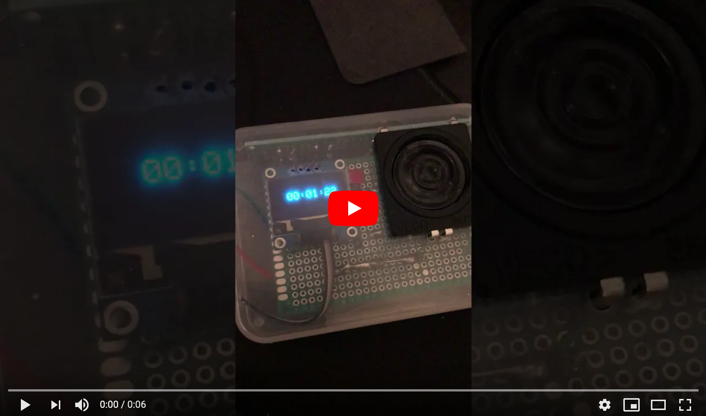
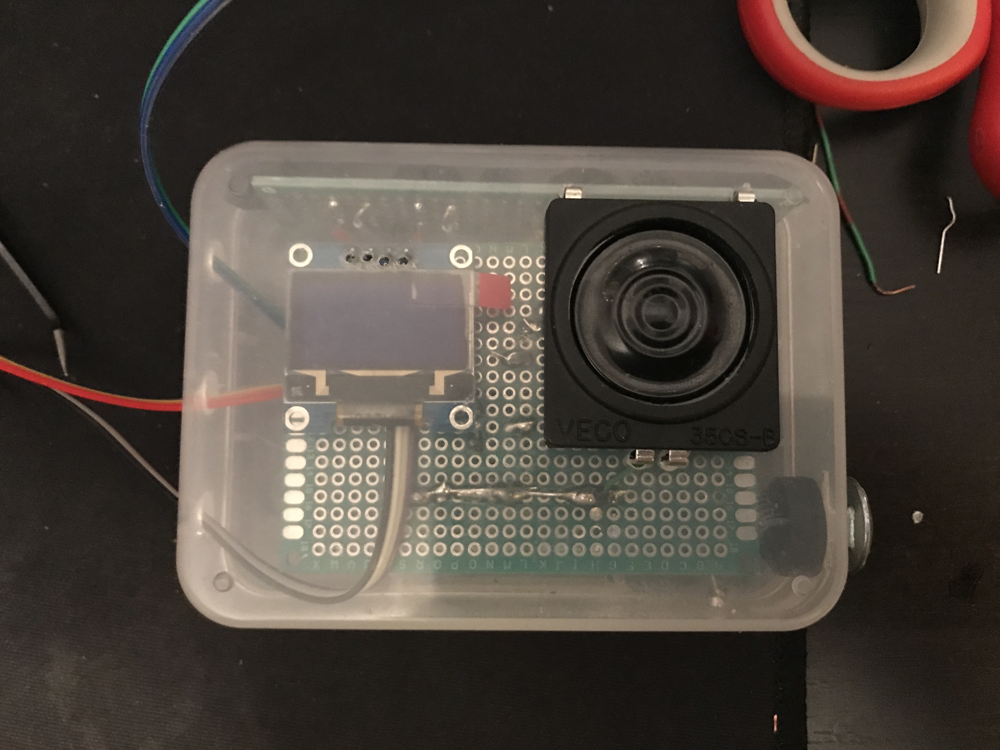

# Cuckoo

#### Images and Videos

[](https://youtu.be/M00ukcpdEps)

The above video is a short demonstration of the time setting mode of the cuckoo clock. This mode would be displayed when the clock is turned on.




#### Speaker Connection

The speaker is connected to the Arduino through an op-amp circuit based around the LM368 chip. Reading through the chip's datasheet I found a basic circuit to use the op-amp and this is what I implemented. In this folder is a screenshot of the schematic I used (I altered it slightly to accommodate the various resistor and capacitor values I had available).


#### Interrupt Usage

All three interrupt timers are used in my program. The breakdown is as follows:

* Timer0: used to keep track of time and is queried via the `micros()` function.
* Timer1: used to trigger an ISR with a frequency of 8kHz which is described in more detail below.
* Timer2: used for PWM to estimate a waveform.

`ISR(TIMER1_COMPA_vect)` is used to achieve two main points of functionallity. First, it keeps track of the overall time with the help of `micros()`, and second, it gathers the data that is passed to `fastpwm_play_sample()` to estimate a waveform at a sample rate of 8kHz (the frequency of this interrupt as well, which makes sense since the PWM function is called once per interrupt).

In order to keep track of time, I have a counter `t` that keeps track of the number of seconds that have transpired. To count a second, I subtract the current time as sampled by `micros()` from a previously sampled time and compare this to 1000000 (the number of microseconds in a second). If the result of the subtraction is greater than or equal to 1000000, I count a second and set the previously sampled time to most recent sampling. In code, this is represented by the following lines:

```
  test_time = micros();
  if (test_time - start_time >= 1000000) {
    start_time = test_time;
    t++;

    ... other stuff ...
  }
```

When a second passes I check whether I should play a tick-toc sound (every 5 seconds), a ding-dong (every 30 minutes past the hour), or a cuckoo (every hour). If a sound needs to be played I read the relevant byte from flash memory (the byte was stored there using PROGMEM) and pass it to the PWM to play via `fastpwm_play_sample()`. In the case that two tones are played at the same time, such as every half hour and every hour, I subtract 128 (the zero of the waveform) from the sum of the two bytes.

Note that I did edit the sound files of `cuckoo_u8.h` and `ding_dong_u8.h` to improve upon the clipping that happened when creating the header files from the wav files in the first place. I did this by finding a scale factor based on the max and min of the waveform and scaling the entire waveform by this factor.


#### Setting the Time

To set the time, I decided to use three buttons. One button is held down to activate "time setting mode" and the other two buttons increment hours and minutes. When the clock is turned on for the first time, a set message is flashed asking the user to set the time officially. As a design decision, I do not allow the user to set the seconds. When in "time setting mode" the number of seconds freezes and resumes when the "time setting mode" button is released.


#### Other Features

There are a few other things that I did to complete this build. Namely, I:

* displayed the time using an LCD display
* improved sound quality/volume using an op-amp
* Soldered my prototype to a protoboard

These extra credit tasks were fun. Soldering took me two tries to get right as the first time wasn't super neat about it. Displaying the time on the LCD screen was a challenge in that I couldn't update the screen's buffer and print to the screen in the interrupt handler as those operations take too long. Thus, I had to use the `loop()` function to keep updating the display, only stopping when an interrupt is received. This seemed to work out pretty nicely. The code for writing text to the screen was taken from a library which is included in my handin.


#### Memory Usage

I stored the sound files in flash memory using PROGMEM. The sound files and my LCD screen libraries took up 42890 bytes of flash memory. Luckily, using the Mega this all fits in flash. If I were to use the Uno I wouldn't be able to fit the LCD screen libraries as well as the sound files even if I were to down sample (take out every other byte in the sound files and reduce the sample rate to 4000).


#### Compilation and Running

To compile and run the code the `ArducamSSD1306-master` directory should be dragged into the corresponding Arduino `libraries` directory. Aside from that, everything else should be standard.


#### Testing Results

The clock held up well over a 24-hour period. The constant drift I experienced with the Mega was easily compensated as is shown in the ISR (I made a two-line comment about it).

I use an unsigned long to keep track of elapsed seconds. Since an unsigned long's max value is 4.2*10^9 this translates to 49710 days or recorded time or 136 years which seemed a reasonable amount of time to go before having to manually reset the clock again :).
